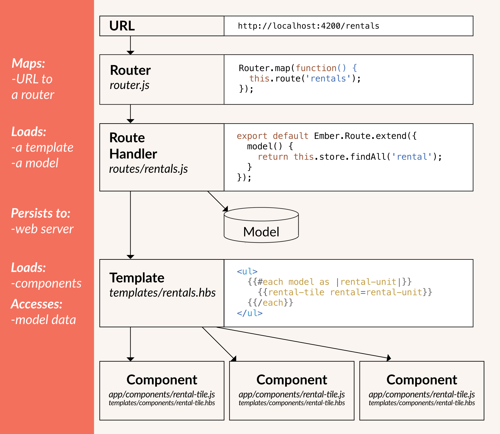

Ember のコードを書き始める前に、Ember アプリケーションのしくみの概要を確認するのをおすすめします。



## ルーターとルート ハンドラー

レンタルのWeb アプリケーションを書いていると仮定してみてください。 いつでも、*どの物件を探しているのか?* や *それを編集をしているのか?* といったそのときの状況がすぐに分かるようにしなければいけません。Emberではそれらの問題の答えは、URLによって解決されています。 URL はいくつかの方法で設定することが可能です。

* ユーザーが、初めてアプリケーションを読み込みこんだとき。
* ユーザーが手動で、[戻る] ボタンをクリックするあるいは、アドレス バーを編集して、手動でURL の変更を行ったとき。
* ユーザーがアプリケーション内のリンクをクリックしたとき。
* それら以外のイベンドによってURLが変更されたとき。

URL がどのように設定されたかに関わらず、まず Ember ルーターがルートハンドラと URL を関連付けます。

通常、ルートハンドラは次の二つのことを行います。

* テンプレートを描画する。
* テンプレートで利用するmodel を読み込みます。

## テンプレート

Ember はHTML のレイアウトを調整するためにテンプレートを利用します。

Ember のコードベースのテンプレートの大部分は、即座に違和感のない、HTMLの断片のようにみえるでしょう。

```handlebars
<div>こんにちは、これは有効な Ember テンプレートです!</div>
```

Ember テンプレートは[Handlebars](http://handlebarsjs.com)の構文を利用しています。有効なHandlebarsの構文なら、それは有効なEmber の構文です。

テンプレートは、コンポーネントまたルート (技術的には、コントローラーがルートからそのモデルをテンプレートに表示しているが、この方法はモダンな Ember ではほとんど利用されておらず、近いうちにデプリケーションされることになっています。) の、そのコンテキストからに提供されたプロパティを表示することもできます。 例えば

```handlebars
<div>こんにちは {{name}}、これは有効な Ember テンプレートです!</div>
```

ここでは、`{{name}}` は、テンプレートのコンテキストによって提供されたプロパティです。

ダブルカーリーブレースは(`{{}}`) プロパティ以外にも、ヘルパーやコンポーネント含んでいることもありますが、これらについては後ほど、説明します。

## モデル

モデルは、永続的な状態を表します。

例えば、レンタルアプリケーションはユーザーがレンタル品の公開をした時、レンタル品の詳細を保存したいとします、その場合おそらく、レンタル品とその詳細を定義した*rental* モデルと呼ばれるモデルがあるでしょう。

通常モデルは、web サーバーに情報を保持しますが、それ以外のブラウザのローカルストレージといった場所に保存するように設定することも可能です。

## コンポーネント

テンプレートでは、ユーザー インターフェイスを記述する一方、コンポーネント は*動作* をコントロールしています。.

コンポーネントは、Handlebarで記載されたテンプレートと、コンポーネントの動作を定義するJavaScript で記述されたソース ファイルの2 つの部分で構成されます:。 例えば、資産レンタルアプリケーションはすべてのレンタル品を表示する`all-rentals`コンポーネントと一つ一つのレンラル品を表示すt`rental-tile`があるかもしれません。 `rental-tile`コンポーネントはユーザーがレンタル品の写真を表示したり、消したりする動作の定義があるかもしれません。

次のレッスンでは、不動産賃貸アプリケーションを構築しながらこれらのコアコンセプトを実際に見ていきましょう。