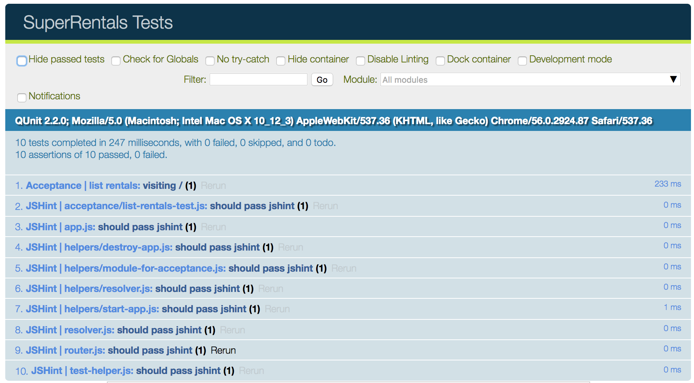

To show the basic setup of an Ember application, we'll walk through building an app for a property rental site called Super Rentals. We'll start with a homepage, an about page and a contact page.

Here's a look at what we want to build before we get started.


Let's work through what we want to do on the home page. We want our application to:

* Show rentals on the home page
* Link to information about the company
* Link to contact information
* List the available rentals
* Filter the list of rentals by city
* Show more details for a selected rental

For the remainder of this page, we'll give you an introduction to testing in Ember and get you set up to add tests as we implement pieces of our app. On subsequent tutorial pages, the final sections of each page will be devoted to adding a test for the feature you just implemented. These sections aren't required for a working application and you may move on with the tutorial without writing them.

At this point, you can continue to the [next page](../routes-and-templates/) or read more about Ember testing below.

### Testing Our Application As We Go

We can represent the goals above as [Ember acceptance tests](../../testing/acceptance/). Acceptance tests interact with our app like an actual person would, but are automated, helping ensure that our app doesn't break in the future.

When we create a new Ember Project using Ember CLI, it uses the [`QUnit`](https://qunitjs.com/) JavaScript test framework to define and run tests.

We'll start by using Ember CLI to generate a new acceptance test:

```shell
ember g acceptance-test list-rentals
```

The command will generate the following output, showing that it created a single file called `tests/acceptance/list-rentals-test.js`.

```shell
installing acceptance-test
  create tests/acceptance/list-rentals-test.js
```

Opening that file will reveal some initial code that will try to go to the `list-rentals` route and verify that the route is loaded. The initial code is there to help us build our first acceptance test.

Since we haven't added any functionality to our application yet, we'll use this first test to get started on running tests in our app.

To do that, replace occurrences of `/list-rentals` in the generated test with `/`. The test will start our app at the base url, `http://localhost:4200/`, and then do a basic check that the page has finished loading and that the url is what we want it to be.

```/tests/acceptance/list-rentals-test.js{-6,+7,-8,+9,-12,+13}
import { test } from 'qunit';
import moduleForAcceptance from 'super-rentals/tests/helpers/module-for-acceptance';

moduleForAcceptance('Acceptance | list-rentals');

test('visiting /list-rentals', function(assert) {
test('visiting /', function(assert) {
  visit('/list-rentals');
  visit('/');

  andThen(function() {
    assert.equal(currentURL(), '/list-rentals');
    assert.equal(currentURL(), '/');
  });
});
```

A few of things to note in this simple test:

* Acceptance tests are setup by calling the function `moduleForAcceptance`. This function ensures that your Ember application is started and shut down between each test.
* QUnit passes in an object called an [`assert`](https://api.qunitjs.com/category/assert/) to each test function. An `assert` has functions, such as `equal()`, that allow your test to check for conditions within the test environment. A test must have one passing assert to be successful.
* Ember acceptance tests use a set of test helper functions, such as the `visit`, `andThen`, and `currentURL` functions used above. We'll discuss those functions in more detail later in the tutorial.

Now run your test suite with the CLI command, `ember test --server`.

By default, when you run `ember test --server`, Ember CLI runs the [Testem test runner](https://github.com/testem/testem), which runs Qunit in Chrome and [PhantomJS](http://phantomjs.org/).

Our launched Chrome web browser now shows 10 successful tests. If you toggle the box labeled "Hide passed tests", you should see our successful acceptance test, along with 9 passing ESLint tests. Ember tests each file you create for syntax issues (known as "linting") using [ESLint](http://eslint.org/).



### Adding Your Application Goals as Acceptance Tests

As mentioned before, our initial test just made sure everything was running properly. Now let's replace that test with the list of tasks we want our app to handle (described up above).

```/tests/acceptance/list-rentals-test.js
import { test } from 'qunit';
import moduleForAcceptance from 'super-rentals/tests/helpers/module-for-acceptance';

moduleForAcceptance('Acceptance | list-rentals');

test('should show rentals as the home page', function (assert) {
});

test('should link to information about the company.', function (assert) {
});

test('should link to contact information.', function (assert) {
});

test('should list available rentals.', function (assert) {
});

test('should filter the list of rentals by city.', function (assert) {
});

test('should show details for a selected rental', function (assert) {
});
```

Running `ember test --server` will now show 7 failing tests (out of 15). Each of the 6 tests we setup above will fail, plus one ESLint test will fail saying, `assert is defined but never used`. The tests above fail because QUnit requires at least one check for a specific condition (known as an `assert`).

As we continue through this tutorial, we'll use these acceptance tests as our checklist. Once all the tests are passing, we'll have accomplished our high level goals.
