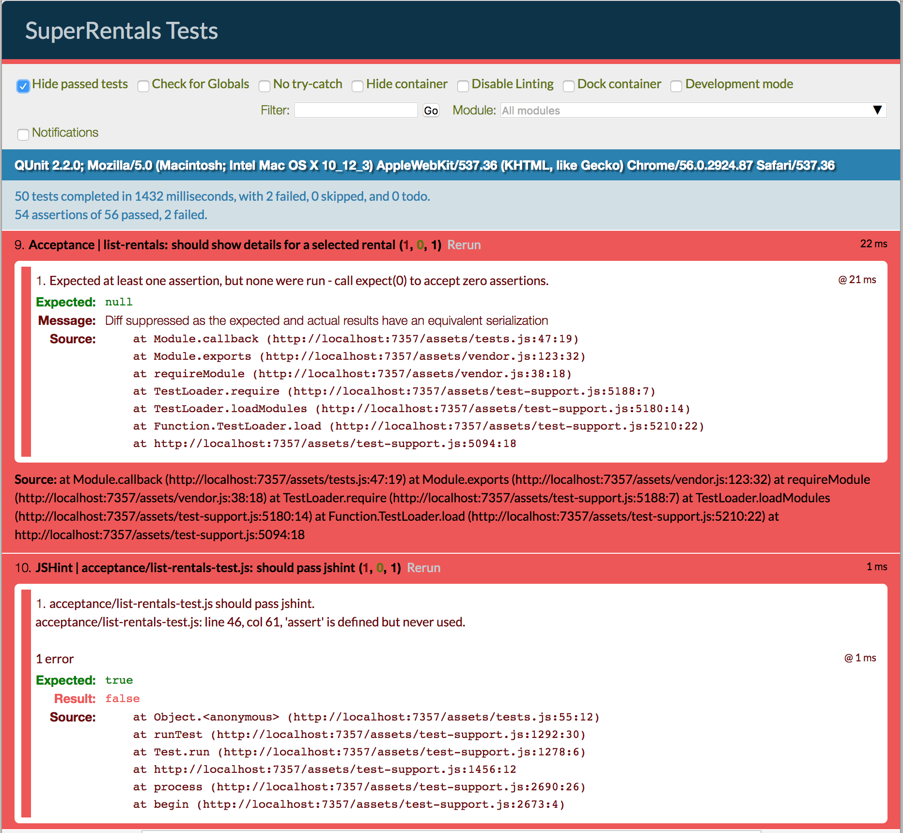

As they search for a rental, users might also want to narrow their search to a specific city.
While our [initial](../simple-component/) rental listing component only displayed rental information, this new filter component will also allow the user to provide input in the form of filter criteria.

To begin, let's generate our new component.
We'll call this component `list-filter`, since all we want our component to do is filter the list of rentals based on input.

```shell
ember g component list-filter
```

As before when we created the [`rental-listing` component](../simple-component), the "generate component" CLI command creates

* a Handlebars template (`app/templates/components/list-filter.hbs`),
* a JavaScript file (`app/components/list-filter.js`),
* and a component integration test (`tests/integration/components/list-filter-test.js`).

In our `app/templates/rentals.hbs` template file, we'll add a reference to our new `list-filter` component.

Notice that below we "wrap" our rentals markup inside the open and closing mentions of `list-filter` on lines 12 and 20.
This is an example of the [**block form**](../../components/wrapping-content-in-a-component) of a component,
which allows a Handlebars template to be rendered _inside_ the component's template wherever the `{{yield}}` expression appears.

In this case we are passing, or "yielding", our filter data to the inner markup as a variable called `rentals` (line 14).

```app/templates/rentals.hbs
<div class="jumbo">
  <div class="right tomster"></div>
  <h2>Welcome!</h2>
  <p>
    We hope you find exactly what you're looking for in a place to stay.
  </p>
  {{#link-to 'about' class="button"}}
    About Us
  {{/link-to}}
</div>

{{#list-filter
   filter=(action 'filterByCity')
   as |rentals|}}
  <ul class="results">
    {{#each rentals as |rentalUnit|}}
      <li>{{rental-listing rental=rentalUnit}}</li>
    {{/each}}
  </ul>
{{/list-filter}}
```


We want the component to simply provide an input field and yield the results list to its block, so our template will be simple:

```app/templates/components/list-filter.hbs
{{input value=value
        key-up=(action 'handleFilterEntry')
        class="light"
        placeholder="Filter By City"}}
{{yield results}}
```

The template contains an [`{{input}}`](../../templates/input-helpers) helper that renders as a text field, in which the user can type a pattern to filter the list of cities used in a search.
The `value` property of the `input` will be kept in sync with the `value` property in the component. 

Another way to say this is that the `value` property of `input` is [**bound**](../../object-model/bindings/) to the `value` property of the component.
If the property changes, either by the user typing in the input field, or by assigning a new value to it in our program,
the new value of the property is present in both the rendered web page and in the code.

The `key-up` property will be bound to the `handleFilterEntry` action.

Here is what the component's JavaScript looks like:

```app/components/list-filter.js
import Ember from 'ember';

export default Ember.Component.extend({
  classNames: ['list-filter'],
  value: '',

  init() {
    this._super(...arguments);
    this.get('filter')('').then((results) => this.set('results', results));
  },

  actions: {
    handleFilterEntry() {
      let filterInputValue = this.get('value');
      let filterAction = this.get('filter');
      filterAction(filterInputValue).then((filterResults) => this.set('results', filterResults));
    }
  }

});
```

We use the `init` hook to seed our initial listings by calling the `filter` action with an empty value.
Our `handleFilterEntry` action calls a function called `filter` based on the `value` attribute set by the input helper.

The `filter` function is passed in by the calling object. This is a pattern known as [closure actions](../../components/triggering-changes-with-actions/#toc_passing-the-action-to-the-component).

Notice the `then` function called on the result of calling the `filter` function.
The code expects the `filter` function to return a promise.
A [promise](http://emberjs.com/api/classes/RSVP.Promise.html) is a JavaScript object that represents the result of an asynchronous function.
A promise may or may not be executed at the time you receive it.
To account for this, it provides functions, like `then` that let you give it code it will run when it eventually does receive a result.


To implement the `filter` function to do the actual filter of rentals by city, we'll create a `rentals` controller.
[Controllers](../../controllers/) contain actions and properties available to the template of its corresponding route.
In our case we want to generate a controller called `rentals`.
Ember will know that a controller with the name of `rentals` will apply to the route with the same name.

Generate a controller for the `rentals` route by running the following:

```shell
ember g controller rentals
```

Now, define your new controller like so:

```app/controllers/rentals.js
import Ember from 'ember';

export default Ember.Controller.extend({
  actions: {
    filterByCity(param) {
      if (param !== '') {
        return this.get('store').query('rental', { city: param });
      } else {
        return this.get('store').findAll('rental');
      }
    }
  }
});
```

When the user types in the text field in our component, the `filterByCity` action in the controller is called.
This action takes in the `value` property, and filters the `rental` data for records in data store that match what the user has typed thus far.
The result of the query is returned to the caller.

For this action to work, we need to replace our Mirage `config.js` file with the following, so that it can respond to our queries.
Instead of simply returning the list of rentals, our Mirage HTTP GET handler for `rentals` will return rentals matching the string provided in the URL query parameter called `city`.

```mirage/config.js
export default function() {
  this.namespace = '/api';

  let rentals = [{
      type: 'rentals',
      id: 'grand-old-mansion',
      attributes: {
        title: 'Grand Old Mansion',
        owner: 'Veruca Salt',
        city: 'San Francisco',
        type: 'Estate',
        bedrooms: 15,
        image: 'https://upload.wikimedia.org/wikipedia/commons/c/cb/Crane_estate_(5).jpg',
        description: "This grand old mansion sits on over 100 acres of rolling hills and dense redwood forests."
      }
    }, {
      type: 'rentals',
      id: 'urban-living',
      attributes: {
        title: 'Urban Living',
        owner: 'Mike Teavee',
        city: 'Seattle',
        type: 'Condo',
        bedrooms: 1,
        image: 'https://upload.wikimedia.org/wikipedia/commons/0/0e/Alfonso_13_Highrise_Tegucigalpa.jpg',
        description: "A commuters dream. This rental is within walking distance of 2 bus stops and the Metro."
      }
    }, {
      type: 'rentals',
      id: 'downtown-charm',
      attributes: {
        title: 'Downtown Charm',
        owner: 'Violet Beauregarde',
        city: 'Portland',
        type: 'Apartment',
        bedrooms: 3,
        image: 'https://upload.wikimedia.org/wikipedia/commons/f/f7/Wheeldon_Apartment_Building_-_Portland_Oregon.jpg',
        description: "Convenience is at your doorstep with this charming downtown rental. Great restaurants and active night life are within a few feet."
      }
    }];

  this.get('/rentals', function(db, request) {
    if(request.queryParams.city !== undefined) {
      let filteredRentals = rentals.filter(function(i) {
        return i.attributes.city.toLowerCase().indexOf(request.queryParams.city.toLowerCase()) !== -1;
      });
      return { data: filteredRentals };
    } else {
      return { data: rentals };
    }
  });
}
```

After updating our mirage configuration, we should see passing tests, as well as a simple filter on your home screen,
that will update the rental list as you type:


You can now proceed on to implement the [next feature](../service/), or continue on to test our newly created filter component.

### An Integration Test

Now that we've created a new component for filtering a list,
we want to create a test to verify it.
Let's use a [component integration test](../../testing/testing-components)
to verify our component behavior,
similar to [how we tested our rental listing component earlier](../simple-component/#toc_an-integration-test).

Lets begin by opening the component integration test created when we generated our `list-filter` component, `tests/integration/components/list-filter-test.js`.
Remove the default test, and create a new test that verifies that by default, the component will list all items.

```tests/integration/components/list-filter-test.js
import { moduleForComponent, test } from 'ember-qunit';
import hbs from 'htmlbars-inline-precompile';

moduleForComponent('list-filter', 'Integration | Component | filter listing', {
  integration: true
});

test('should initially load all listings', function (assert) {
});
```

Our list-filter component takes a function as an argument, used to find the list of matching rentals based on the filter string provided by the user.
We provide an action function by setting it to the local scope of our test by calling `this.on`.

```tests/integration/components/list-filter-test.js{+3,+5,+6,+13,+14,+15,+16,+17,+18,+19,+20,+21}
import { moduleForComponent, test } from 'ember-qunit';
import hbs from 'htmlbars-inline-precompile';
import RSVP from 'rsvp';

const ITEMS = [{city: 'San Francisco'}, {city: 'Portland'}, {city: 'Seattle'}];
const FILTERED_ITEMS = [{city: 'San Francisco'}];

moduleForComponent('list-filter', 'Integration | Component | filter listing', {
  integration: true
});

test('should initially load all listings', function (assert) {
  // we want our actions to return promises,
  //since they are potentially fetching data asynchronously
  this.on('filterByCity', (val) => {
    if (val === '') {
      return RSVP.resolve(ITEMS);
    } else {
      return RSVP.resolve(FILTERED_ITEMS);
    }
  });

});
```

`this.on` will add the provided function to the test local scope as `filterByCity`, which we can use to provide to the component.

Our `filterByCity` function is going to pretend to be the action function for our component, that does the actual filtering of the rental list.

If the search input is empty, the function is going to return three cities.
If the the search input is not empty, its going to return just one.
If our component is coded correctly, it should in turn display the three cities on initial render and just show one once a character is given to the search box.

We are not testing the actual filtering of rentals in this test, since it is focused on only the capability of the component.
We will test the full logic of filtering in acceptance tests, described in the next section.

Since our component is expecting the filter process to be asynchronous, we return promises from our filter, using [Ember's RSVP library](http://emberjs.com/api/classes/RSVP.html).

Next, we'll add the call to render the component to show the cities we've provided above.

```tests/integration/components/list-filter-test.js{+23,+24,+25,+26,+27,+28,+29,+30,+31,+32,+33,+34,+35,+36}
import { moduleForComponent, test } from 'ember-qunit';
import hbs from 'htmlbars-inline-precompile';
import RSVP from 'rsvp';

const ITEMS = [{city: 'San Francisco'}, {city: 'Portland'}, {city: 'Seattle'}];
const FILTERED_ITEMS = [{city: 'San Francisco'}];

moduleForComponent('list-filter', 'Integration | Component | filter listing', {
  integration: true
});

test('should initially load all listings', function (assert) {
  // we want our actions to return promises,
  //since they are potentially fetching data asynchronously
  this.on('filterByCity', (val) => {
    if (val === '') {
      return RSVP.resolve(ITEMS);
    } else {
      return RSVP.resolve(FILTERED_ITEMS);
    }
  });

  // with an integration test,
  // you can set up and use your component in the same way your application
  // will use it.
  this.render(hbs`
    {{#list-filter filter=(action 'filterByCity') as |results|}}
      <ul>
      {{#each results as |item|}}
        <li class="city">
          {{item.city}}
        </li>
      {{/each}}
      </ul>
    {{/list-filter}}
  `);

});
```

Finally we add a `wait` call at the end of our test to assert the results.

Ember's [wait helper](../../testing/testing-components/#toc_waiting-on-asynchronous-behavior)
waits for all asynchronous tasks to complete before running the given function callback.
It returns a promise that we also return from the test.

If you return a promise from a QUnit test, the test will wait to finish until that promise is resolved.
In this case our test completes when the `wait` helper decides that processing is finished,
and the function we provide that asserts the resulting state is completed.

```tests/integration/components/list-filter-test.js{+3,+37,+38,+39,+40}
import { moduleForComponent, test } from 'ember-qunit';
import hbs from 'htmlbars-inline-precompile';
import wait from 'ember-test-helpers/wait';
import RSVP from 'rsvp';

moduleForComponent('list-filter', 'Integration | Component | filter listing', {
  integration: true
});

const ITEMS = [{city: 'San Francisco'}, {city: 'Portland'}, {city: 'Seattle'}];
const FILTERED_ITEMS = [{city: 'San Francisco'}];

test('should initially load all listings', function (assert) {
  // we want our actions to return promises, since they are potentially fetching data asynchronously
  this.on('filterByCity', (val) => {
    if (val === '') {
      return RSVP.resolve(ITEMS);
    } else {
      return RSVP.resolve(FILTERED_ITEMS);
    }
  });

  // with an integration test,
  // you can set up and use your component in the same way your application will use it.
  this.render(hbs`
    {{#list-filter filter=(action 'filterByCity') as |results|}}
      <ul>
      {{#each results as |item|}}
        <li class="city">
          {{item.city}}
        </li>
      {{/each}}
      </ul>
    {{/list-filter}}
  `);

  return wait().then(() => {
    assert.equal(this.$('.city').length, 3);
    assert.equal(this.$('.city').first().text().trim(), 'San Francisco');
  });
});
```

For our second test, we'll check that typing text in the filter will actually appropriately call the filter action and update the listings shown.

We force the action by generating a `keyUp` event on our input field, and then assert that only one item is rendered.

```tests/integration/components/list-filter-test.js
test('should update with matching listings', function (assert) {
  this.on('filterByCity', (val) => {
    if (val === '') {
      return RSVP.resolve(ITEMS);
    } else {
      return RSVP.resolve(FILTERED_ITEMS);
    }
  });

  this.render(hbs`
    {{#list-filter filter=(action 'filterByCity') as |results|}}
      <ul>
      {{#each results as |item|}}
        <li class="city">
          {{item.city}}
        </li>
      {{/each}}
      </ul>
    {{/list-filter}}
  `);

  // The keyup event here should invoke an action that will cause the list to be filtered
  this.$('.list-filter input').val('San').keyup();

  return wait().then(() => {
    assert.equal(this.$('.city').length, 1);
    assert.equal(this.$('.city').text().trim(), 'San Francisco');
  });
});

```
Now both integration test scenarios should pass.
You can verify this by starting up our test suite by typing `ember t -s` at the command line.

### Acceptance Tests

Now that we've tested that the `list-filter` component behaves as expected, let's test that the page itself also behaves properly with an acceptance test.
We'll verify that a user visiting the rentals page can enter text into the search field and narrow the list of rentals by city.

Open our existing acceptance test, `tests/acceptance/list-rentals-test.js`, and implement the test labeled "should filter the list of rentals by city".


```/tests/acceptance/list-rentals-test.js
test('should filter the list of rentals by city.', function (assert) {
  visit('/');
  fillIn('.list-filter input', 'Seattle');
  keyEvent('.list-filter input', 'keyup', 69);
  andThen(function() {
    assert.equal(find('.listing').length, 1, 'should show 1 listing');
    assert.equal(find('.listing .location:contains("Seattle")').length, 1, 'should contain 1 listing with location Seattle');
  });
});
```

We introduce two new helpers into this test, `fillIn` and `keyEvent`.

* The [`fillIn`](http://emberjs.com/api/classes/Ember.Test.html#method_fillIn) helper "fills in" the given text into an input field matching the given selector.
* The [`keyEvent`](http://emberjs.com/api/classes/Ember.Test.html#method_keyEvent) helper sends a key stroke event to the UI, simulating the user typing a key.

In `app/components/list-filter.js`, we have as the top-level element rendered by the component a class called `list-filter`.
We locate the search input within the component using the selector `.list-filter input`,
since we know that there is only one input element located in the list-filter component.

Our test fills out "Seattle" as the search criteria in the search field,
and then sends a `keyup` event to the same field with a code of `69` (the `e` key) to simulate a user typing.

The test locates the results of the search by finding elements with a class of `listing`,
which we gave to our `rental-listing` component in the ["Building a Simple Component"](../simple-component) section of the tutorial.

Since our data is hard-coded in Mirage, we know that there is only one rental with a city name of "Seattle",
so we assert that the number of listings is one and that the location it displays is named, "Seattle".

The test verifies that after filling in the search input with "Seattle", the rental list reduces from 3 to 1,
and the item displayed shows "Seattle" as the location.

You should be down to only 2 failing tests: One remaining acceptance test failure; and our JSHint test that fails on an unused assert for our unimplemented test.




