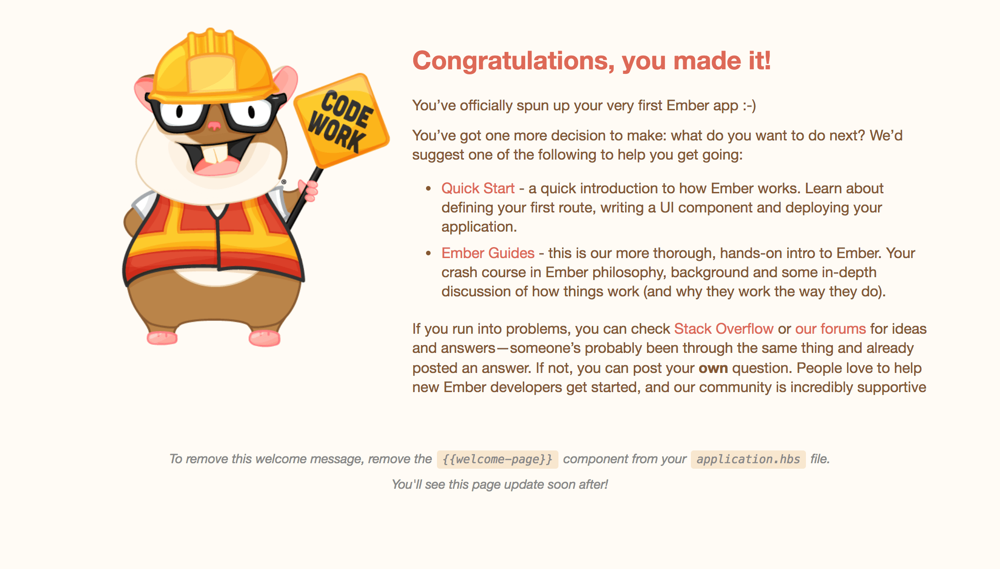

Ember CLI 是 Ember 的命令行界面。它提供了一个标准的项目结构、一套开发工具、以及一个插件系统。 它能让 Ember 开发者更专注于构建应用程序本身，而不是花时间去构建那些为了让程序运行起来所必须的支持性结构。 在命令行环境下，你可以很简单地通过 `ember --help` 来显示 Ember CLI 所提供的所有命令。 要了解某个特定命令的详细信息，输入 `ember help <command-name>` 即可。.

## 创建一个新应用程序

要用 Ember CLI 创建一个新项目，可以使用 `new` 命令。为了给本教程的下一节做准备，你可以创建一个应用程序叫做 `super-rentals`。.

```shell
ember new super-rentals
```

## 目录结构

`new` 命令生成由以下这些文件和目录构成的项目结构：

```text
|--app
|--bower_components
|--config
|--dist
|--node_modules
|--public
|--tests
|--tmp
|--vendor

bower.json
ember-cli-build.js
package.json
README.md
testem.js
```

我们来看一下 Ember CLI 生成的这些文件夹和文件。

**app**：这里储存所有关于数据模型、组件、路由、模板和样式表的文件夹和文件。一个 Ember 项目的大部分编码都会在这个文件夹中进行。

**bower_components / bower.json**：Bower 是一个依赖管理工具。 在 Ember CLI 中，它用于管理前端插件和组件依赖（如 HTML、CSS、Javascript 等）。 所有 Bower 组件都安装在 `bower_components` 目录下。 打开 `bower.json`你可以看到自动安装好的依赖，包括 Ember、Ember CLI Shims和用于测试的 QUnit 。 如果我们添加一个新的前端依赖，例如 Bootstrap，我们也会发现它会列在这个文件中，并且被添加到 `bower_components` 目录。

**config**：config 目录包含 `environment.js` 文件，你可以在这里配置你的应用程序。

**dist**：当我们构建好用于部署的应用程序时，所有的输出文件都被创建到这里。

**node_modules / package.json**：这两个目录和文件来自 npm。 npm 是 Node.js 的包管理器。 Ember 本身便是用 Node 构建的，而且它的操作也用到了大量的 Node.js 模块。 The `package.json` file maintains the list of current npm dependencies for the app. Any Ember CLI add-ons you install will also show up here. 所有列在 `package.json` 中的包都会被安装到 node_modules 目录中。

**public**：这个目录下包含图片、字体等静态资源。

**vendor**：这个目录包含所有不被 Bower 管理的前端依赖，诸如 Javascript 或 CSS。

**tests / testem.js**：自动化测试都在 `tests` 文件夹中。Ember CLI 的测试运行器 **testem** 则在 `testem.js` 文件中进行配置。.

**tmp**：存放 Ember CLI 的临时文件。

**ember-cli-build.js**：这个文件描述 Ember CLI 应该如何构建我们的应用程序。

## ES6 模块

如果你观察一下 `app/router.js` 文件就会发现，有些语法可能对你来说不太熟悉。

```app/router.js import Ember from 'ember'; import config from './config/environment';

const Router = Ember.Router.extend({ location: config.locationType, rootURL: config.rootURL });

Router.map(function() { });

export default Router;

    <br />Ember CLI 使用 ECMAScript 2015（简称 ES2015，以前也叫 ES6）模块来组织应用程序代码。
    比如说 `import Ember from 'ember';` 这一行，让我们可以通过 `Ember` 变量来访问实际的 Ember.js 库。 而 `import config from './config/environment';` 这一行则让我们可以通过 `config` 变量来访问程序的配置数据。 `const` 是一种声明只读变量的方法，以确保该变量的值不会在其它地方被误更改。 在文件的末尾，`export default Router;` 使得此文件中定义的 `Router` 变量可以从应用程序的其它地方来调用。
    
    ## 升级 Ember
    
    在继续本教程之前，首先确保你安装的是最新版本的 Ember和Ember Data。 如果 `bower.json` 中 `ember` 和 `ember-data` 的版本号低于这篇指南左上角显示的版本号，请更新 `bower.json` 中的两个版本号，然后执行 `bower install`升级。
    同样，如果`ember-data`在`package.json`是较低版本，则更改版本号，然后运行 `npm install`升级。
    
    ## 开发模式启动服务器
    
    当我们的新项目已经准备就绪，我们可以通过下面的命令启动服务器来确保一切运转正常。
    
    ```shell
    ember server
    

也可以缩写如下：

```shell
ember s
```

在浏览器打开[`http://localhost:4200`](http://localhost:4200)，我们会看到默认的欢迎页面。 只要你在文件`app/templates/application.hbs`里添加你的代码 ，新增加的代码就会显示在欢迎页面上。

