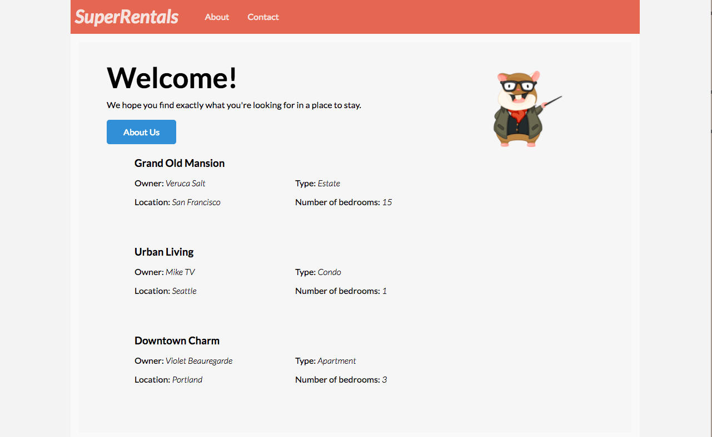

Ember tiene un rico ecosistema de addons (complementos) que pueden añadirse fácilmente a los proyectos. Los addons (complementos) proveen una amplia gama de funcionalidad a los proyectos, a menudo ahorrando de tiempo y dejando que te enfoques en tu proyecto.

Para buscar addons (complementos), visite el sitio web de [Ember Observer](https://emberobserver.com/). Cataloga y clasifica los addons (complementos) que se han publicado en NPM y les asigna una puntuación basado en una variedad de criterios.

Para Super Rentals, utilizaremos dos addons: [ember-cli-tutorial-style](https://github.com/toddjordan/ember-cli-tutorial-style) y [ember-cli-mirage](http://www.ember-cli-mirage.com/).

### ember-cli-tutorial-style

En lugar de tener que copiar/pegar el CSS de Super Rentals, hemos creado un addon (complemento) llamado [ember-cli-tutorial-style](https://github.com/ember-learn/ember-cli-tutorial-style) que inmediatamente añadirá el CSS para el tutorial. El addon (complemento) funciona creando un archivo llamado `ember-tutorial.css` y poner ese archivo en el directorio `vendor` de super-rentals. Cuando Ember CLI se ejecuta, toma el archivo CSS de `ember-tutorial` y lo pone en `vendor.css` (que es referenciado en `/app/index.html`). Podemos hacer ajustes adicionales al estilo `/vendor/ember-tutorial.css`, y los cambios tendrán efecto cuando reinicies la aplicación.

Ejecuta el siguiente comando para instalar el addon (complemento):

```shell
ember install ember-cli-tutorial-style
```

Iniciar el servidor incorporará el nuevo CSS y actualizar el navegador te mostrará esto:



### ember-cli-mirage

[Mirage](http://www.ember-cli-mirage.com/) es una biblioteca que permite generar respuestas HTTP, y es utilizada a menudo para pruebas de aceptación de Ember. Para el caso de este tutorial, usaremos mirage como nuestro origen de datos. Mirage nos permitirá crear datos falsos mientras desarrollamos nuestra aplicación y simular un servidor back-end en ejecución.

Instalar el addon (complemento) de la siguiente forma:

```shell
ember install ember-cli-mirage
```

Si te encuentras ejecutando `ember serve` en otra línea de comandos, reinicia el servidor para incluir Mirage en tu compilación.

Vamos a configurar ahora Mirage para enviar nuestros rentals que hemos definido anteriormente actualizando `mirage/config.js`:

```app/mirage/config.js
export default function() {
  this.get('/rentals', function() {
    return {
      data: [{
        type: 'rentals',
        id: 1,
        attributes: {
          title: 'Grand Old Mansion',
          owner: 'Veruca Salt',
          city: 'San Francisco',
          type: 'Estate',
          bedrooms: 15,
          image: 'https://upload.wikimedia.org/wikipedia/commons/c/cb/Crane_estate_(5).jpg'
        }
      }, {
        type: 'rentals',
        id: 2,
        attributes: {
          title: 'Urban Living',
          owner: 'Mike Teavee',
          city: 'Seattle',
          type: 'Condo',
          bedrooms: 1,
          image: 'https://upload.wikimedia.org/wikipedia/commons/0/0e/Alfonso_13_Highrise_Tegucigalpa.jpg'
        }
      }, {
        type: 'rentals',
        id: 3,
        attributes: {
          title: 'Downtown Charm',
          owner: 'Violet Beauregarde',
          city: 'Portland',
          type: 'Apartment',
          bedrooms: 3,
          image: 'https://upload.wikimedia.org/wikipedia/commons/f/f7/Wheeldon_Apartment_Building_-_Portland_Oregon.jpg'
        }
      }]
    };
  });
}
```

Esto configura Mirage para que cada vez que Ember Data hace una petición GET a `/rentals`, Mirage retornará este objeto JavaScript como JSON.