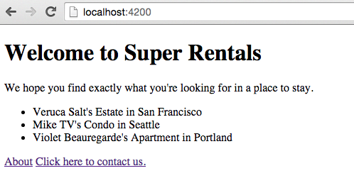
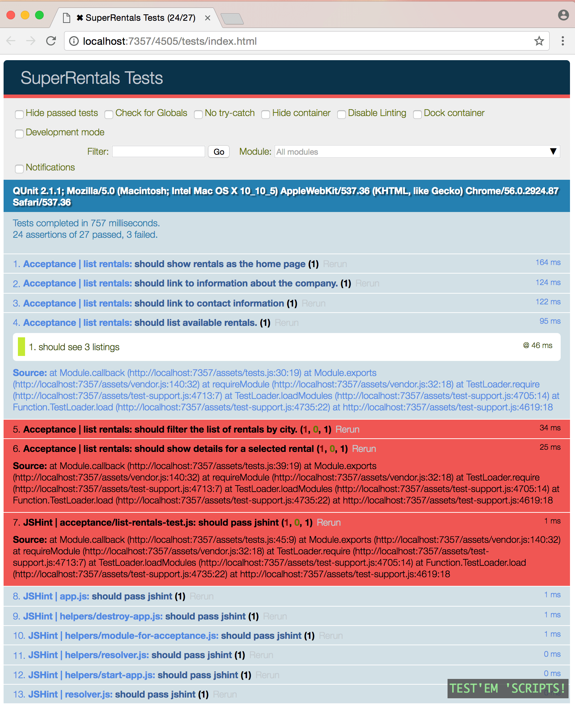

Ahora, vamos a añadir una lista de los alquileres disponibles en la template (plantilla) index. Sabemos que los rentals no son estáticos, debido a que eventualmente los usuarios podrán agregarlos, actualizarlos y borrarlos. Por esta razón, necesitaremos un model (modelo) de *rentals* para guardar información acerca de los alquileres. Para mantener las cosas simples inicialmente, usaremos un arreglo de objectos JavaScript hardcoded. Después, empezaremos a usar Ember Data, una biblioteca para manejar los datos robustamente en nuestra aplicación.

Así se verá nuestra página principal cuando terminemos:



In Ember, route handlers are responsible for loading model data. Let's open `app/routes/rentals.js` and add our hard-coded data as the return value of the `model` hook:

```app/routes/rentals.js import Ember from 'ember';

let rentals = [{ id: 'grand-old-mansion', title: 'Grand Old Mansion', owner: 'Veruca Salt', city: 'San Francisco', type: 'Estate', bedrooms: 15, image: 'https://upload.wikimedia.org/wikipedia/commons/c/cb/Crane_estate_(5).jpg' }, { id: 'urban-living', title: 'Urban Living', owner: 'Mike TV', city: 'Seattle', type: 'Condo', bedrooms: 1, image: 'https://upload.wikimedia.org/wikipedia/commons/0/0e/Alfonso_13_Highrise_Tegucigalpa.jpg' }, { id: 'downtown-charm', title: 'Downtown Charm', owner: 'Violet Beauregarde', city: 'Portland', type: 'Apartment', bedrooms: 3, image: 'https://upload.wikimedia.org/wikipedia/commons/f/f7/Wheeldon_Apartment_Building_-_Portland_Oregon.jpg' }];

export default Ember.Route.extend({ model() { return rentals; } });

    <br />Acá estamos usando la sintaxis corta de ES6 para la definición de métodos: `model ()` es lo mismo que escribir `model: function ()`.
    
    The `model` function acts as a **hook**, meaning that Ember will call it for us during different times in our app.
    The model hook we've added to our `rentals` route handler will be called when a user enters the `rentals` route.
    
    The `model` hook returns our _rentals_ array and passes it to our `rentals` template as the `model` property.
    
    Ahora, vamos a pasar a nuestra plantilla.
    Podemos utilizar los datos de los modelos para mostrar la lista de los alquileres.
    Aquí, usaremos otro helper común de Handlebars llamado `{{each}}`.
    This helper will let us loop through each of the objects in our model:
    
    ```app/templates/rentals.hbs{+13,+14,+15,+16,+17,+18,+19,+20,+21,+22,+23,+24,+25,+26,+27,+28,+29}
    <div class="jumbo">
      <div class="right tomster"></div>
      <h2>Welcome!</h2>
      <p>
        We hope you find exactly what you're looking for in a place to stay.
        <br>Browse our listings, or use the search box below to narrow your search.
      </p>
      {{#link-to 'about' class="button"}}
        About Us
      {{/link-to}}
    </div>
    
    {{#each model as |rental|}}
      <article class="listing">
        <h3>{{rental.title}}</h3>
        <div class="detail owner">
          <span>Owner:</span> {{rental.owner}}
        </div>
        <div class="detail type">
          <span>Type:</span> {{rental.type}}
        </div>
        <div class="detail location">
          <span>Location:</span> {{rental.city}}
        </div>
        <div class="detail bedrooms">
          <span>Number of bedrooms:</span> {{rental.bedrooms}}
        </div>
      </article>
    {{/each}}
    

En esta plantilla, recorremos cada objeto del modelo y lo llamamos *alquiler*. Para cada alquiler, creamos una lista con información sobre la propiedad.

Now that we are listing rentals, our acceptance test validating that rentals display should show passing:

