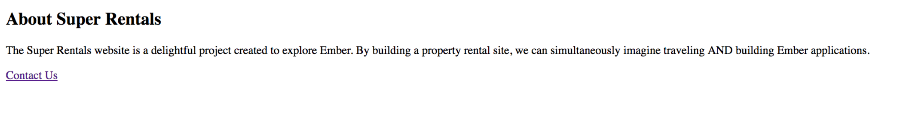
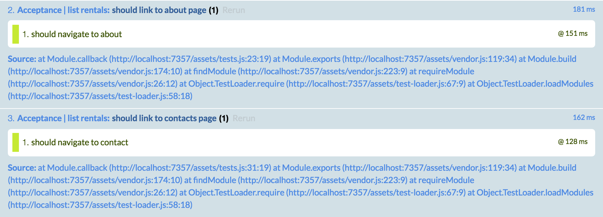

Ember アプリケーションの基本的な準備と、順序を示すために、この項目では、Super Rentalsという資産レンタルのEmber アプリケーションの構築を順を追って示していきます。 homeページ、aboutページと、contact ページから始めましょう。 その前に、ユーザーの目線でアプリケーションを見てみましょう。


ホームページはレンタルのリストを表示しています。ここから、about ページと contact ページに遷移することができます。

Now, let's start by building our "about" page. Remember, when the URL path `/about` is loaded, the router will map the URL to the route handler of the same name, *about.js*. The route handler then loads a template.

## ルートに関して

If we run `ember help generate`, we can see a variety of tools that come with Ember for automatically generating files for various Ember resources. Let's use the route generator to start our `about` route.

```shell
ember generate route about
```

or for short,

```shell
ember g route about
```

We can then see what actions were taken by the generator:

```shell
installing route
  create app/routes/about.js
  create app/templates/about.hbs
updating router
  add route about
installing route-test
  create tests/unit/routes/about-test.js
```

Three new files are created: one for the route handler, one for the template the route handler will render, and a test file. The fourth file that is touched is the router.

When we open the router, we can see that the generator has mapped a new *about* route for us. This route will load the `about` route handler.

```app/router.js import Ember from 'ember'; import config from './config/environment';

const Router = Ember.Router.extend({ location: config.locationType, rootURL: config.rootURL });

Router.map(function() { this.route('about'); });

export default Router;

    <br />デフォルトで、`about` route handler (ルートハンドラー)は`about.hbs`  template (テンプレート)を読み込みます。
    これは`app/routes/about.js` を書き換えなくても、 `about.hbs` が表示されることを意味しています。
    
    generator (ジェネレータ)によって必要なルーティングが完了しているので、すぐに template (テンプレート)の編集が行えます。
    For our `about` page, we'll add some HTML that has a bit of information about the site:
    
    ```app/templates/about.hbs
    <div class="jumbo">
      <div class="right tomster"></div>
      <h2>About Super Rentals</h2>
      <p>
        The Super Rentals website is a delightful project created to explore Ember.
        By building a property rental site, we can simultaneously imagine traveling
        AND building Ember applications.
      </p>
    </div>
    

Run `ember serve` (or `ember s` for short) from the shell to start the Ember development server, and then go to [`http://localhost:4200/about`](http://localhost:4200/about) to see our new app in action!

## Contact ルート

Let's create another route with details for contacting the company. Once again, we'll start by generating a route, a route handler, and a template.

```shell
ember g route contact
```

We see that our generator has created a `contact` route in the `app/router.js` file, and a corresponding route handler in `app/routes/contact.js`. Since we will be using the `contact` template, the `contact` route does not need any additional changes.

In `contact.hbs`, we can add the details for contacting our Super Rentals HQ:

```app/templates/contact.hbs 

<div class="jumbo">
  <div class="right tomster">
  </div>
  
  <h2>
    Contact Us
  </h2>
  
  <p>
    Super Rentals Representatives would love to help you<br />choose a destination or answer any questions you may have.
  </p>
  
  <p>
    Super Rentals HQ 
    
    <address>
      1212 Test Address Avenue<br /> Testington, OR 97233
    </address>
    
    <a href="tel:503.555.1212">+1 (503) 555-1212</a><br /> <a href="mailto:superrentalsrep@emberjs.com">superrentalsrep@emberjs.com</a>
  </p>
</div>

    <br />これで、２番目のルートが完成しました。
    URL[`http://localhost:4200/contact`](http://localhost:4200/contact)にアクセスすると、contact pageにアクセスできます。
    
    ## リンクによるナビゲーションと {{link-to}} Helper (ヘルバー)
    
    アプリケーション内を遷移するのに、ユーザーがURLを知る必要があるようなことは、望んでません、そこで各ページの下部にナビゲーション用のリンクを追加しましょう。
    それではaboutページにcontactページへのリンク、aboutページにはcontactへのリンクを作ります。
    
    Ember には他のルートへのリンクなどの機能を提供する**helpers (ヘルパー)** が組み込まれています。
    ここでは routes (ルート)間のリンクを表示するために `{{link-to}}` helper (ヘルパー)を利用します:
    
    ```app/templates/about.hbs{+9,+10,+11}
    <div class="jumbo">
      <div class="right tomster"></div>
      <h2>About Super Rentals</h2>
      <p>
        The Super Rentals website is a delightful project created to explore Ember.
        By building a property rental site, we can simultaneously imagine traveling
        AND building Ember applications.
      </p>
      {{#link-to 'contact' class="button"}}
        Get Started!
      {{/link-to}}
    </div>
    

The `{{link-to}}` helper takes an argument with the name of the route to link to, in this case: `contact`. When we look at our about page at [`http://localhost:4200/about`](http://localhost:4200/about), we now have a working link to our contact page.



Now, we'll add a link to our contact page so we can navigate from back and forth between `about` and `contact`.

```app/templates/contact.hbs 

<div class="jumbo">
  <div class="right tomster">
  </div>
  
  <h2>
    Contact Us
  </h2>
  
  <p>
    Super Rentals Representatives would love to help you<br />choose a destination or answer any questions you may have.
  </p>
  
  <p>
    Super Rentals HQ 
    
    <address>
      1212 Test Address Avenue<br /> Testington, OR 97233
    </address>
    
    <a href="tel:503.555.1212">+1 (503) 555-1212</a><br /> <a href="mailto:superrentalsrep@emberjs.com">superrentalsrep@emberjs.com</a>
  </p> {{#link-to 'about' class="button"}} About {{/link-to}}
</div>

    <br />## Index Route(ルート)
    
    静的なページがが二つ完成したので、サイトに来たユーザーを迎える home を追加する準備ができました。
    about ページと contact ページの手順と同様に、`index`という名前の route (ルート)を生成することから始めます。
    
    ```shell
    ember g route index
    

We can see the now familiar output for the route generator:

```shell
installing route
  create app/routes/index.js
  create app/templates/index.hbs
installing route-test
  create tests/unit/routes/index-test.js
```

Unlike the other route handlers we've made so far, the `index` route is special: it does NOT require an entry in the router's mapping. We'll learn more about why the entry isn't required when we look at nested routes in Ember.

Let's update our `index.hbs` with some HTML for our home page and our links to the other routes in our application:

```app/templates/index.hbs 

<div class="jumbo">
  <div class="right tomster">
  </div>
  
  <h2>
    Welcome!
  </h2>
  
  <p>
    We hope you find exactly what you're looking for in a place to stay. <br />Browse our listings, or use the search box above to narrow your search.
  </p> {{#link-to 'about' class="button"}} About Us {{/link-to}}
</div>

    <br />## ナビゲーションの有るバナーを追加
    
    アプリケーションの各 route (ルート)の、ボタンスタイルのリンクに追加して、共通のアプリケーションのタイトルと、そのメインページを表示したいと思います。
    
    First, create the application by typing `ember g template application`.
    
    ```shell
    installing template
      create app/templates/application.hbs
    

When `application.hbs` exists, anything you put in it is shown for every page in the application. Now add the following banner navigation markup:

    app/templates/application.hbs
    <div class="container">
      <div class="menu">
        {{#link-to 'index'}}
          <h1 class="left">
            <em>SuperRentals</em>
          </h1>
        {{/link-to}}
        <div class="left links">
          {{#link-to 'about'}}
            About
          {{/link-to}}
          {{#link-to 'contact'}}
            Contact
          {{/link-to}}
        </div>
      </div>
      <div class="body">
        {{outlet}}
      </div>
    </div>

Notice the inclusion of an `{{outlet}}` within the body `div` element. The [`{{outlet}}`](http://emberjs.com/api/classes/Ember.Templates.helpers.html#method_outlet) defers to the router, which will render in its place the markup for the current route, meaning the different routes we develop for our application will get rendered there.

Now that we've added routes and linkages between them, the two acceptance tests we created for navigating the about and contact links will now pass:

