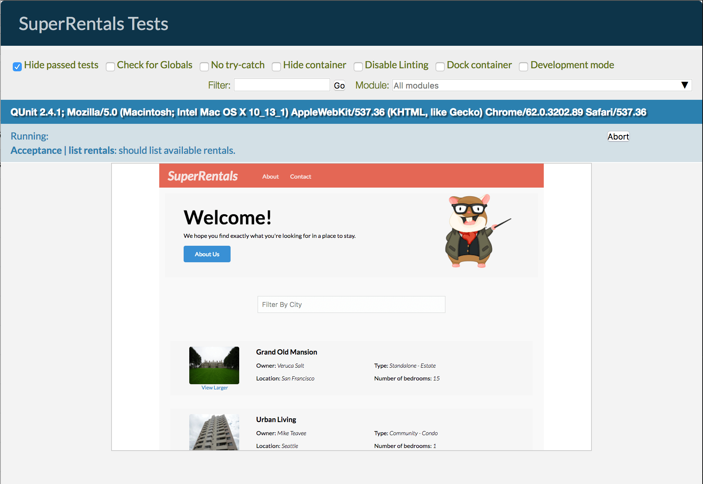

Para Super Rentals, queremos tener un mapa en el que se muestre donde se encuentra cada alquiler. Para implementar esta característica, utilizaremos varios conceptos de Ember:

  1. Un component (componente) para mostrar un mapa en cada anuncio de alquiler.
  2. Un servicio para mantener en caché los mapas renderizados en diferentes lugares de la aplicación.
  3. Una función utility (utilidad) para crear un mapa desde el API de Google Maps.

Empezaremos mostrando el mapa y trabajaremos con lo demás usando el API de Google Maps.

### Mostrar mapas con un Component (componente)

Empezaremos añadiendo un component (componente) que muestra la ciudad donde están los alquileres sobre un mapa.

<pre><code class="app/templates/components/rental-listing.hbs{+19}">&lt;article class="listing"&gt;
  &lt;a {{action 'toggleImageSize'}} class="image {{if isWide "wide"}}"&gt;
    &lt;img src="{{rental.image}}" alt=""&gt;
    &lt;small&gt;View Larger&lt;/small&gt;
  &lt;/a&gt;
  &lt;h3&gt;{{rental.title}}&lt;/h3&gt;
  &lt;div class="detail owner"&gt;
    &lt;span&gt;Owner:&lt;/span&gt; {{rental.owner}}
  &lt;/div&gt;
  &lt;div class="detail type"&gt;
    &lt;span&gt;Type:&lt;/span&gt; {{rental-property-type rental.type}} - {{rental.type}}
  &lt;/div&gt;
  &lt;div class="detail location"&gt;
    &lt;span&gt;Location:&lt;/span&gt; {{rental.city}}
  &lt;/div&gt;
  &lt;div class="detail bedrooms"&gt;
    &lt;span&gt;Number of bedrooms:&lt;/span&gt; {{rental.bedrooms}}
  &lt;/div&gt;
  {{location-map location=rental.city}}
&lt;/article&gt;
</code></pre>

Next, generate the map component using Ember CLI.

```shell
ember g component location-map
```

Ejecutar este comando genera tres archivos: un archivo de JavaScript para el component (componente) y una template (plantilla) y un archivo de test. Para ayudar a pensar en lo que queremos que el componente haga, implementaremos el test primero.

En este caso, planeamos que nuestro service (servicio) de Google Maps se encargue de mostrar el mapa. El trabajo de nuestro component (componente) será tomar los resultados del servicio del mapa (que es un elemento de tipo mapa) y añadirlo a un elemento en la template (plantilla) del component (componente).

Para limitar el test solamente a validar este comportamiento, usaremos el API de registro para proveer un stub de servicio de mapas falso. El stub sustituye al objeto real en tu aplicación y simula su comportamiento. En el service (servicio) del stub, se define un método que obtendrá un mapa basado en la ubicación, llamado `getMapElement`.

<pre><code class="tests/integration/components/location-map-test.js">import { moduleForComponent, test } from 'ember-qunit';
import hbs from 'htmlbars-inline-precompile';
import Ember from 'ember';

let StubMapsService = Ember.Service.extend({
  getMapElement(location) {
    this.set('calledWithLocation', location);
    // We create a div here to simulate our maps service,
    // which will create and then cache the map element
    return document.createElement('div');
  }
});

moduleForComponent('location-map', 'Integration | Component | location map', {
  integration: true,
  beforeEach() {
    this.register('service:maps', StubMapsService);
    this.inject.service('maps', { as: 'mapsService' });
  }
});

test('should append map element to container element', function(assert) {
  this.set('myLocation', 'New York');
  this.render(hbs`{{location-map location=myLocation}}`);
  assert.equal(this.$('.map-container').children().length, 1, 'the map element should be put onscreen');
  assert.equal(this.get('mapsService.calledWithLocation'), 'New York', 'a map of New York should be requested');
});
</code></pre>

En la función `beforeEach` que se ejecuta antes de cada prueba, utilizamos la función implícita `this.register` para registrar nuestro service (servicio) stub en lugar del service (servicio) de mapas. Registrar un objeto lo pone a disposición para su aplicación de Ember para cosas como cargar componentes de plantillas e inyectar servicios en este caso.

Llamar a la función `this.inject.service` inyecta el service (servicio) que acabas de registrar en el contexto de las pruebas, por lo que cada prueba puede acceder a él a través de `this.get('mapsService')`. En el ejemplo afirmamos (assert) que `calledWithLocation` en nuestro stub está configurado con la ubicación que pasamos al componente.

Para hacer que la prueba pase, añadimos el elemento contenedor a la template (plantilla) del component (componente).

<pre><code class="app/templates/components/location-map.hbs">&lt;div class="map-container"&gt;&lt;/div&gt;
</code></pre>

Luego actualizamos el componente para agregar el output del mapa a su elemento contenedor interno. Agregaremos una inyección del service (servicio) de mapas, y llamaremos a la función `getMapElement` con la ubicación proporcionada.

We then append the map element we get back from the service by implementing `didInsertElement`, which is a [component lifecycle hook](../../components/the-component-lifecycle/#toc_integrating-with-third-party-libraries-with-code-didinsertelement-code). Esta función es ejecutada cuando se renderiza, después que el código del component (componente) se inserta en el DOM.

<pre><code class="app/components/location-map.js">import Ember from 'ember';

export default Ember.Component.extend({
  maps: Ember.inject.service(),

  didInsertElement() {
    this._super(...arguments);
    let location = this.get('location');
    let mapElement = this.get('maps').getMapElement(location);
    this.$('.map-container').append(mapElement);
  }
});
</code></pre>

### Obteniendo los mapas con un service (servicio)

Ahora que tenemos un test de integración del component (componente) que aprueba, pero no se muestra ningún mapa cuando vemos nuestra página web. Para generar los mapas, implementaremos el servicio de mapas.

Accedemos el API de los mapas a través de un servicio nos da varios beneficios

* It is injected with a [service locator](https://en.wikipedia.org/wiki/Service_locator_pattern), meaning it will abstract the maps API from the code that uses it, allowing for easier refactoring and maintenance.
* Se inicializará únicamente hasta que se llame por primera vez. En algunos casos, esto puede reducir el uso de Cpu y memoria de la aplicación.
* Es un singleton, lo cual nos permitirá tener en caché toda la información del mapa.
* Utiliza un ciclo de vida, lo que significa que tendremos ganchos para ejecutar códigos de limpieza cuando el servicio se detenga, previniendo cosas como fugas de memoria y procesamiento innecesario.

Let's get started creating our service by generating it through Ember CLI, which will create the service file, as well as a unit test for it.

```shell
ember g service maps
```

El servicio mantiene una caché de los elementos del mapa basado en la localización. Si el elemento del mapa existe en el caché, el servicio lo retornará, de lo contrario creará uno nuevo y lo agregará al caché.

Para probar nuestro servicio, lo que queremos afirmar es que lugares que han sido previamente cargados se obtienen del caché, mientras que nuevas localidades se crean mediante la utility (utilidad).

<pre><code class="tests/unit/services/maps-test.js">import { moduleFor, test } from 'ember-qunit';
import Ember from 'ember';

const DUMMY_ELEMENT = {};

let MapUtilStub = Ember.Object.extend({
  createMap(element, location) {
    this.assert.ok(element, 'createMap called with element');
    this.assert.ok(location, 'createMap called with location');
    return DUMMY_ELEMENT;
  }
});

moduleFor('service:maps', 'Unit | Service | maps', {
  needs: ['util:google-maps']
});

test('should create a new map if one isnt cached for location', function (assert) {
  assert.expect(4);
  let stubMapUtil = MapUtilStub.create({ assert });
  let mapService = this.subject({ mapUtil: stubMapUtil });
  let element = mapService.getMapElement('San Francisco');
  assert.ok(element, 'element exists');
  assert.equal(element.className, 'map', 'element has class name of map');
});

test('should use existing map if one is cached for location', function (assert) {
  assert.expect(1);
  let stubCachedMaps = Ember.Object.create({
    sanFrancisco: DUMMY_ELEMENT
  });
  let mapService = this.subject({ cachedMaps: stubCachedMaps });
  let element = mapService.getMapElement('San Francisco');
  assert.equal(element, DUMMY_ELEMENT, 'element fetched from cache');
});
</code></pre>

Ten en cuenta que la prueba utiliza un objeto ficticio como el elemento mapa que retorna el service (servicio). Esto puede ser cualquier objeto debido a que solo se utiliza para afirmar que el caché ha sido accedido. También ten en cuenta que la ubicación ha sido convertida a `CamelCase` en el objeto cache, por lo que se puede utilizar como una clave.

Ahora implementemos el servicio de la siguiente manera. Ten en cuenta que debemos comprobar que si un mapa ya existe para la ubicación dada y utilizarla, si no llamamos a una utility (utilidad) de Google Maps para que la cree. Abstraemos nuestra interacción con la API de mapas de detrás de una utility (utilidad) de Ember para que podemos probar nuestro service (servicio) sin hacer peticiones de red a Google.

```app/services/maps.js
import Ember from 'ember';
import MapUtil from '../utils/google-maps';

export default Ember.Service.extend({

  init() {
    if (!this.get('cachedMaps')) {
      this.set('cachedMaps', Ember.Object.create());
    }
    if (!this.get('mapUtil')) {
      this.set('mapUtil', MapUtil.create());
    }
  },

  getMapElement(location) {
    let camelizedLocation = location.camelize();
    let element = this.get(`cachedMaps.${camelizedLocation}`);
    if (!element) {
      element = this.createMapElement();
      this.get('mapUtil').createMap(element, location);
      this.set(`cachedMaps.${camelizedLocation}`, element);
    }
    return element;
  },

  createMapElement() {
    let element = document.createElement('div');
    element.className = 'map';
    return element;
  }

});
```

### Haciendo Google Maps disponible

Antes de implementar la utilidad del mapa, tenemos que hacer que el API de terceros se encuentre disponible para nuestra aplicación de Ember. Hay varias maneras de librerías de terceros en ember. Consulte la sección de guías acerca de la [gestión de las dependencias](../../addons-and-dependencies/managing-dependencies/) como punto de partida cuando necesites agregar una.

Debido a que Google ofrece su API de mapas como un script remoto, usaremos curl para descargar en el directorio vendor de nuestro proyecto.

En el directorio de raíz de tu proyecto, ejecute el siguiente comando para poner el script de Google Maps en la carpeta vendor de tu proyecto como `gmaps.js`.  
`Curl` es un comando UNIX, así que si estás en windows debes aprovechar el [soporte de bash de Windows](https://msdn.microsoft.com/en-us/commandline/wsl/about) o utilizar un método alternativo para descargar el script en el directorio vendor.

```shell
curl -o vendor/gmaps.js https://maps.googleapis.com/maps/api/js?v=3.22
```

Once in the vendor directory, the script can be built into the app. We just need to tell Ember CLI to import it using our build file:

<pre><code class="ember-cli-build.js{+22}">/*jshint node:true*/
/* global require, module */
var EmberApp = require('ember-cli/lib/broccoli/ember-app');

module.exports = function(defaults) {
  var app = new EmberApp(defaults, {
    // Add options here
  });

  // Use `app.import` to add additional libraries to the generated
  // output files.
  //
  // If you need to use different assets in different
  // environments, specify an object as the first parameter. That
  // object's keys should be the environment name and the values
  // should be the asset to use in that environment.
  //
  // If the library that you are including contains AMD or ES6
  // modules that you would like to import into your application
  // please specify an object with the list of modules as keys
  // along with the exports of each module as its value.
  app.import('vendor/gmaps.js');

  return app.toTree();
};
</code></pre>

### Accediendo al API de Google Maps

Ahora que tenemos la API de mapas disponible para la aplicación, podemos crear nuestra (utility) utilidad del mapa. Los archivos del utility (utilidad) pueden ser generados mediante Ember CLI.

```shell
ember g util google-maps
```

El comando `generate util` de Ember CLI creará un archivo de utilidad y un test unitario. Borraremos el test unitario, ya que no queremos probar el código de Google. Nuestra aplicación necesita una sola función, `createMapElement`, que hace uso de `google.maps.Map` para crear nuestro mapa, `google.maps.Geocoder` para buscar las coordenadas de nuestra ubicación y `google.maps.Marker` para fijar nuestro mapa basado en la situación resuelta.

<pre><code class="app/utils/google-maps.js">import Ember from 'ember';

const google = window.google;

export default Ember.Object.extend({

  init() {
    this.set('geocoder', new google.maps.Geocoder());
  },

  createMap(element, location) {
    let map = new google.maps.Map(element, { scrollwheel: false, zoom: 10 });
    this.pinLocation(location, map);
    return map;
  },

  pinLocation(location, map) {
    this.get('geocoder').geocode({address: location}, (result, status) =&gt; {
      if (status === google.maps.GeocoderStatus.OK) {
        let geometry = result[0].geometry.location;
        let position = { lat: geometry.lat(), lng: geometry.lng() };
        map.setCenter(position);
        new google.maps.Marker({ position, map, title: location });
      }
    });
  }

});
</code></pre>

¡Ahora deberíamos tener alguna funcionalidad completa mostrándose en nuestra portada!


### Stubbing Services in Acceptance Tests

Finally, we want to update our acceptance tests to account for our new service. While it would be great to verify that a map is displaying, we don't want to hammer the Google Maps API every time we run our acceptance test. For this tutorial we'll rely on our component integration tests to ensure that the map DOM is being attached to our screen. To avoid hitting our Maps request limit, we'll stub out our Maps service in our acceptance tests.

Often, services connect to third party APIs that are not desirable to include in automated tests. To stub these services we simply have to register a stub service that implements the same API, but does not have the dependencies that are problematic for the test suite.

Add the following code after the imports to our acceptance test:

<pre><code class="/tests/acceptance/list-rentals-test.js">import Ember from 'ember';

let StubMapsService = Ember.Service.extend({
  getMapElement() {
    return document.createElement('div');
  }
});

moduleForAcceptance('Acceptance | list rentals', {
  beforeEach() {
    this.application.register('service:stubMaps', StubMapsService);
    this.application.inject('component:location-map', 'maps', 'service:stubMaps');
  }
});
</code></pre>

What's happening here is we are adding our own stub maps service that simply creates an empty div. Then we are putting it in Ember's [registry](../../applications/dependency-injection#toc_factory-registrations), and injecting it into the `location-map` component that uses it. That way every time that component is created, our stub map service gets injected over the Google maps service. Now when we run our acceptance tests, you'll notice that maps do not get rendered as the test runs.

