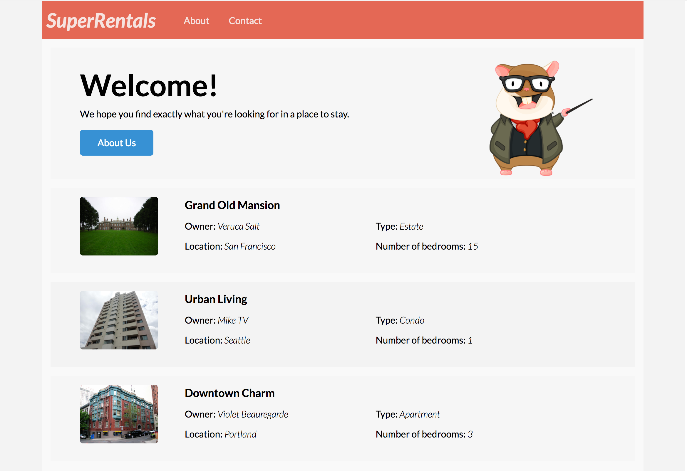

賃貸物件のリストを閲覧している際、ユーザーはインタラクティブな選択肢を使って、意思決定に役立てたいと思うかもしれません。 各賃貸物件の画像のサイズを切り替える機能を追加することにしましょう。 これを実現するために、コンポーネントを利用します。

それでは、各賃貸物件の動作を管理する、`rental-listing`コンポーネントを生成していきましょう。 コンポーネント名のdash (-記号)は、HTML要素名との重複を避けるために必須のものです。そのため、`rental-listing`は許容されますが、`rental`は許容されません。

```shell
ember g component rental-listing
```

コマンドを実行すると、Ember CLI はコンポーネント用のファイルをほんのわずか生成します。

```shell
installing component
  create app/components/rental-listing.js
  create app/templates/components/rental-listing.hbs
installing component-test
  create tests/integration/components/rental-listing-test.js
```

コンポーネントは、2 つの部分で構成されます。

* (`App/templates/components/rental-listing.hbs` の外観を定義するテンプレート)
* JavaScript ソース ファイル (`app/components/rental-listing.js`) が動作するかを定義します。

新規で作成した`rental-listing`コンポーネントはユーザーがレンタル品とどうインタラクションを行うかを管理します。 まず、単一のレンタル品の詳細表示を`index.hbs` テンプレートから`rental-listing.hbs`に移動しましょう。

```app/templates/components/rental-listing.hbs{+2} <article class="listing">  

### {{rental.title}}

<div class="detail owner">
  <span>Owner:</span> {{rental.owner}}
</div>

<div class="detail type">
  <span>Type:</span> {{rental.type}}
</div>

<div class="detail location">
  <span>Location:</span> {{rental.city}}
</div>

<div class="detail bedrooms">
  <span>Number of bedrooms:</span> {{rental.bedrooms}}
</div></article>

    <br />続いて`rentals.hbs`テンプレートです。以前のHTMLマークアップを`rental-listing`コンポーネントによる`{{#each}}`ループで置き換えましょう。
    
    ```app/templates/rentals.hbs{+12,+13,-14,-15,-16,-17,-18,-19,-20,-21,-22,-23,-24,-25,-26,-27,-28,-29}
    <div class="jumbo">
      <div class="right tomster"></div>
      <h2>Welcome!</h2>
      <p>
        We hope you find exactly what you're looking for in a place to stay.
      </p>
      {{#link-to 'about' class="button"}}
        About Us
      {{/link-to}}
    </div>
    
    {{#each model as |rentalUnit|}}
      {{rental-listing rental=rentalUnit}}
    {{#each model as |rental|}}
      <article class="listing">
        <h3>{{rental.title}}</h3>
        <div class="detail owner">
          <span>Owner:</span> {{rental.owner}}
        </div>
        <div class="detail type">
          <span>Type:</span> {{rental.type}}
        </div>
        <div class="detail location">
          <span>Location:</span> {{rental.city}}
        </div>
        <div class="detail bedrooms">
          <span>Number of bedrooms:</span> {{rental.bedrooms}}
        </div>
      </article>
    {{/each}}
    

ここでは`rental-listing` コンポーネントをその名称で呼び出しています、そして各`rentalUnit`をコンポーネントの`rental` 属性として割り当てています。

アプリケーションは、各賃貸物件用の画像が追加された状態で、以前と同様に動作します。



## イメージの表示/非表示

これで、ユーザーからの要求によって賃貸物件画像を表示する機能を追加できるようになりました。

`{{if}}`helper (ヘルパー) を使って、`isWide`がtrueに設定されているときだけ要素クラス名を`wide`に設定することで、現在の賃貸物件画像を大きく表示しましょう。 イメージがクリック可能だと示すテキストも追加します。そして、それらをアンカー要素でまとめ`image`クラスを与えることで、テストがそれを見つけられるようにします。

```app/templates/components/rental-listing.hbs{+2,+4,+5} <article class="listing"> <a class="image {{if isWide "wide"}}">  <small>View Larger</small> </a> 

### {{rental.title}}

<div class="detail owner">
  <span>Owner:</span> {{rental.owner}}
</div>

<div class="detail type">
  <span>Type:</span> {{rental.type}}
</div>

<div class="detail location">
  <span>Location:</span> {{rental.city}}
</div>

<div class="detail bedrooms">
  <span>Number of bedrooms:</span> {{rental.bedrooms}}
</div></article>

    <br />`isWide`の値は、component (コンポーネント)のJavaScriptファイル、この場合は`rental-listing.js`から与えられます。
    はじめは画像を非表示にしたいので、次のようにプロパティを`false`に設定します。
    
    ```app/components/rental-listing.js{+4}
    import Ember from 'ember';
    
    export default Ember.Component.extend({
      isWide: false
    });
    

ユーザーが画像を拡大できるようにするには、`isWide`の値をトグルするアクションを追加する必要があります。 それでは、このアクション`toggleImageSize`アクションを呼び出しましょう。

```app/templates/components/rental-listing.hbs{+2} <article class="listing"> <a {{action 'toggleimagesize'}} class="image {{if isWide "wide"}}">  <small>View Larger</small> </a> 

### {{rental.title}}

<div class="detail owner">
  <span>Owner:</span> {{rental.owner}}
</div>

<div class="detail type">
  <span>Type:</span> {{rental.type}}
</div>

<div class="detail location">
  <span>Location:</span> {{rental.city}}
</div>

<div class="detail bedrooms">
  <span>Number of bedrooms:</span> {{rental.bedrooms}}
</div></article>

    <br />アンカー要素をクリックすると、コンポーネントにアクションが送られます。
    そうするとEmber は`actions`ハッシュに推移し、`toggleImageSize` ファンクションを呼び出します。
    
    [actionハッシュ](../../templates/actions/) は関数を含むコンポーネント内のオブジェクトです。
    これらの関数は、クリック操作など、ユーザーがUIを操作した際に呼び出されます。
    
    コンポーネントに`toggleImageSize`関数を作成し、`isWide`プロパティをトグルするようにしましょう。
    
    ```app/components/rental-listing.js{+5,+6,+7,+8,+9}
    import Ember from 'ember';
    
    export default Ember.Component.extend({
      isWide: false,
      actions: {
        toggleImageSize() {
          this.toggleProperty('isWide');
        }
      }
    });
    

これで、ブラウザー上の`View Larger`リンクをクリックすると、画像が拡大されます。 そして、拡大された画像をクリックすれば、画像はまた小さくなります。


次の機能を作るために[次のページ](../hbs-helper/)に移るか、このまま続けて、上記で書いたコードをテストしてください。

### 結合テスト

Emberコンポーネントは、通常[コンポーネント用の結合テスト](../../testing/testing-components/)によってテストされています。 コンポーネント用の結合テストは、Emberのレンダリングエンジンのコンテキスト内でのコンポーネントの動作を検証します。 結合テストを実行すると、コンポーネントは通常の[レンダリングライフサイクル](../../components/the-component-lifecycle/)を経由し、Emberのリゾルバによって読み込まれた依存オブジェクトへの参照を持ちます。

ここでのコンポーネント結合テストでは、2つの異なる動作をテストします。

* コンポーネントは賃貸物件についての詳細を表示すべきです
* 賃貸物件の写真を拡大縮小するために、コンポーネントはクリックによってwideクラスの存在をトグルすべきです

それでは、検証したいシナリオを含むようテストを更新しましょう。

```tests/integration/components/rental-listing-test.js import { moduleForComponent, test } from 'ember-qunit'; import hbs from 'htmlbars-inline-precompile'; import Ember from 'ember';

moduleForComponent('rental-listing', 'Integration | Component | rental listing', { integration: true });

test('should display rental details', function(assert) {

});

test('should toggle wide class on click', function(assert) {

});

    <br />テスト用に、賃貸物件モデルが持っているすべてのプロパティを持つ偽オブジェクトをコンポーネントに渡します。
    `rental`という変数名にし、`this`オブジェクトによって表現される各テストのローカルスコープに、その`rental`を設定します。
    描画テンプレートはローカルスコープ内の値にアクセスできます。
    
    ```tests/integration/components/rental-listing-test.js
    import { moduleForComponent, test } from 'ember-qunit';
    import hbs from 'htmlbars-inline-precompile';
    import Ember from 'ember';
    
    let rental = Ember.Object.create({
      image: 'fake.png',
      title: 'test-title',
      owner: 'test-owner',
      type: 'test-type',
      city: 'test-city',
      bedrooms: 3
    });
    
    moduleForComponent('rental-listing', 'Integration | Component | rental listing', {
      integration: true
    });
    
    test('should display rental details', function(assert) {
      this.set('rentalObj', rental);
    });
    
    test('should toggle wide class on click', function(assert) {
      this.set('rentalObj', rental);
    });
    

それでは、`render`関数を使ってコンポーネントを描画しましょう。 `render`関数にはテンプレート文字列を渡せるので、テンプレート内で行うのと同じ方法でコンポーネントを宣言できます。 ローカルスコープに`rentalObj`変数を設定することで、描画文字列の一部としてその内容にアクセスできます。

```tests/integration/components/rental-listing-test.js import { moduleForComponent, test } from 'ember-qunit'; import hbs from 'htmlbars-inline-precompile'; import Ember from 'ember';

let rental = Ember.Object.create({ image: 'fake.png', title: 'test-title', owner: 'test-owner', type: 'test-type', city: 'test-city', bedrooms: 3 });

moduleForComponent('rental-listing', 'Integration | Component | rental listing', { integration: true });

test('should display rental details', function(assert) { this.set('rentalObj', rental); this.render(hbs`{{rental-listing rental=rentalObj}}`); });

test('should toggle wide class on click', function(assert) { this.set('rentalObj', rental); this.render(hbs`{{rental-listing rental=rentalObj}}`); });

    <br />最後に、アクションと検証処理を追加しましょう。
    
    最初のテストではコンポーネントの出力を検証したいので、タイトルと所有者のテキストが偽の`rental`に設定した内容と一致することだけを検証します。
    
    ```tests/integration/components/rental-listing-test.js
    test('should display rental details', function(assert) {
      this.set('rentalObj', rental);
      this.render(hbs`{{rental-listing rental=rentalObj}}`);
      assert.equal(this.$('.listing h3').text(), 'test-title', 'Title: test-title');
      assert.equal(this.$('.listing .owner').text().trim(), 'Owner: test-owner');
    });
    

2つ目のテストでは、画像をクリックするとサイズが切り替わるかを検証します。 まず、コンポーネントが最初には`wide`と言うクラスが付かずに描画されることを検証します。 そして画像をクリックするとその要素に`wide`クラスが付与され、もう一度クリックされると`wide`クラスが取り除かれることを検証します。 CSSセレクタ`.image`を使って画像を見つけていることに注目してください。.

```tests/integration/components/rental-listing-test.js test('should toggle wide class on click', function(assert) { this.set('rentalObj', rental); this.render(hbs`{{rental-listing rental=rentalObj}}`); assert.equal(this.$('.image.wide').length, 0, 'initially rendered small'); this.$('.image').click(); assert.equal(this.$('.image.wide').length, 1, 'rendered wide after click'); this.$('.image').click(); assert.equal(this.$('.image.wide').length, 0, 'rendered small after second click'); });

    テストは最終的に次のようになります。
    
    ```tests/integration/components/rental-listing-test.js
    import { moduleForComponent, test } from 'ember-qunit';
    import hbs from 'htmlbars-inline-precompile';
    import Ember from 'ember';
    
    let rental = Ember.Object.create({
      image: 'fake.png',
      title: 'test-title',
      owner: 'test-owner',
      type: 'test-type',
      city: 'test-city',
      bedrooms: 3
    });
    
    moduleForComponent('rental-listing', 'Integration | Component | rental listing', {
      integration: true
    });
    
    test('should display rental details', function(assert) {
      this.set('rentalObj', rental);
      this.render(hbs`{{rental-listing rental=rentalObj}}`);
      assert.equal(this.$('.listing h3').text(), 'test-title');
      assert.equal(this.$('.listing .owner').text().trim(), 'Owner: test-owner');
    });
    
    test('should toggle wide class on click', function(assert) {
      this.set('rentalObj', rental);
      this.render(hbs`{{rental-listing rental=rentalObj}}`);
      assert.equal(this.$('.image.wide').length, 0, 'initially rendered small');
      this.$('.image').click();
      assert.equal(this.$('.image.wide').length, 1, 'rendered wide after click');
      this.$('.image').click();
      assert.equal(this.$('.image.wide').length, 0, 'rendered small after second click');
    });
    

新しいテストが通ることを検証するために、`ember t -s`を実行してください。新しいテストの結果を見つけるには、テスト結果の "Module" フィールド内の "Integration | Component | rental listing" を探してください。