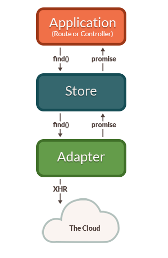
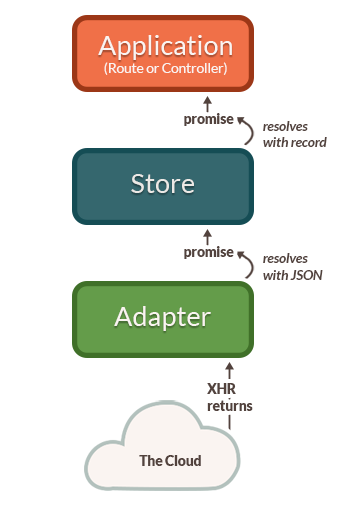
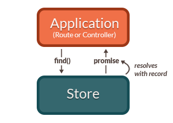

Models are objects that represent the underlying data that your
application presents to the user. Different apps will have very
different models, depending on what problems they're trying to solve.

For example, a photo sharing application might have a `Photo`
model to represent a particular photo, and a `PhotoAlbum` that
represents a group of photos. In contrast, an online shopping app would
probably have different models, like `ShoppingCart`, `Invoice`, or
`LineItem`.

Models tend to be _persistent_. That means the user does not expect
model data to be lost when they close their browser window. To make sure
no data is lost, if the user makes changes to a model, you need to store
the model data somewhere that it will not be lost.

Typically, most models are loaded from and saved to a server that uses a
database to store data. Usually you will send JSON representations of
models back and forth to an HTTP server that you have written. However,
Ember makes it easy to use other durable storage, such as saving to the
user's hard disk with [IndexedDB][indexeddb], or hosted storage solutions that let you
avoid writing and hosting your own servers.

[indexeddb]: https://developer.mozilla.org/en-US/docs/Web/API/IndexedDB_API

Once you've loaded your models from storage, components know how to
translate model data into a UI that your user can interact with.  For
more information about how components get model data, see the
[Specifying a Route's Model](../routing/specifying-a-routes-model)
guide.

Ember Data, included by default when you create a new application, is a
library that integrates tightly with Ember to make it easy to retrieve
models from your server as JSON, save updates back to the server, and
create new models in the browser.

Thanks to its use of the _adapter pattern_, Ember Data can be configured
to work with many different kinds of backends. There is [an entire
ecosystem of adapters][adapters] that allow your Ember app to talk to different
types of servers without you writing any networking code.

[adapters]: http://emberobserver.com/categories/ember-data-adapters

If you need to integrate your Ember.js app with a server that does not
have an adapter available (for example, you hand-rolled an API server
that does not adhere to any JSON specification), Ember Data is designed
to be configurable to work with whatever data your server returns.

Ember Data is also designed to work with streaming servers, like those
powered by WebSockets. You can open a socket to your server and push
changes into Ember Data whenever they occur, giving your app a real-time
user interface that is always up-to-date.

At first, using Ember Data may feel different than the way you're used
to writing JavaScript applications. Many developers are familiar with
using AJAX to fetch raw JSON data from an endpoint, which may appear
easy at first. Over time, however, complexity leaks out into your
application code, making it hard to maintain.

With Ember Data, managing models as your application grows becomes both
simple _and_ easy.

Once you have an understanding of Ember Data, you will have a much
better way to manage the complexity of data loading in your application.
This will allow your code to evolve without becoming a mess.

## The Store and a Single Source of Truth

One common way of building web applications is to tightly couple user
interface elements to data fetching. For example, imagine you are
writing the admin section of a blogging app, which has a feature that
lists the drafts for the currently logged in user.

You might be tempted to make the component responsible for fetching that
data and storing it:

```app/components/list-of-drafts.js
import Component from '@ember/component';

export default Component.extend({
  willRender() {
    $.getJSON('/drafts').then(data => {
      this.set('drafts', data);
    });
  }
});
```

You could then show the list of drafts in your component's template like
this:

```app/templates/components/list-of-drafts.hbs
<ul>
  {{#each drafts key="id" as |draft|}}
    <li>{{draft.title}}</li>
  {{/each}}
</ul>
```

This works great for the `list-of-drafts` component. However, your app
is likely made up of many different components. On another page you
may want a component to display the number of drafts. You may be
tempted to copy and paste your existing `willRender` code into the new
component.

```app/components/drafts-button.js
import Component from '@ember/component';

export default Component.extend({
  willRender() {
    $.getJSON('/drafts').then(data => {
      this.set('drafts', data);
    });
  }
});
```

```app/templates/components/drafts-button.hbs
{{#link-to "drafts" tagName="button"}}
  Drafts ({{drafts.length}})
{{/link-to}}
```

Unfortunately, the app will now make two separate requests for the
same information. Not only is the redundant data fetching costly in
terms of wasted bandwidth and affecting the perceived speed of your
app, it's easy for the two values to get out-of-sync. You yourself
have probably used a web application where the list of items gets out
of sync with the counter in a toolbar, leading to a frustrating and
inconsistent experience.

There is also a _tight coupling_ between your application's UI and the
network code. If the url or the format of the JSON payload changes, it
is likely to break all of your UI components in ways that are hard to
track down.

The SOLID principles of good design tell us that objects should have a
single responsibility. The responsibility of a component should be
presenting model data to the user, not fetching the model.

Good Ember apps take a different approach. Ember Data gives you a single
**store** that is the central repository of models in your application.
Routes and their corresponding controllers can ask the store for models, and the store is
responsible for knowing how to fetch them.

It also means that the store can detect that two different components
are asking for the same model, allowing your app to only fetch the data
from the server once. You can think of the store as a read-through cache
for your app's models. Both routes and their corresponding controllers have access to
this shared store; when they need to display or modify a model, they
first ask the store for it.

## Convention Over Configuration with JSON API

You can significantly reduce the amount of code you need to write and
maintain by relying on Ember's conventions. Since these conventions
will be shared among developers on your team, following them leads
to code that is easier to maintain and understand.

Rather than creating an arbitrary set of conventions, Ember Data is
designed to work out of the box with [JSON API][json-api]. JSON API is a
formal specification for building conventional, robust, and performant
APIs that allow clients and servers to communicate model data.

[json-api]: http://jsonapi.org

JSON API standardizes how JavaScript applications talk to servers, so
you decrease the coupling between your frontend and backend, and have
more freedom to change pieces of your stack.

As an analogy, JSON API is to JavaScript apps and API servers what SQL is
to server-side frameworks and databases. Popular frameworks like Ruby on
Rails, Laravel, Django, Spring and more work out of the box with many
different databases, like MySQL, PostgreSQL, SQL Server, and more.

Frameworks (or apps built on those frameworks) don't need to write
lots of custom code to add support for a new database; as long as that
database supports SQL, adding support for it is relatively easy.

So too with JSON API. By using JSON API to interop between your Ember
app and your server, you can entirely change your backend stack without
breaking your frontend. And as you add apps for other platforms, such as
iOS and Android, you will be able to leverage JSON API libraries for
those platforms to easily consume the same API your Ember app uses.

## Models

In Ember Data, each model is represented by a subclass of `Model` that
defines the attributes, relationships, and behavior of the data that you
present to the user.

Models define the type of data that will be provided by your server. For
example, a `Person` model might have a `firstName` attribute that is a
string, and a `birthday` attribute that is a date:

```app/models/person.js
import DS from 'ember-data';

export default DS.Model.extend({
  firstName: DS.attr('string'),
  birthday:  DS.attr('date')
});
```

A model also describes its relationships with other objects. For
example, an `order` may have many `line-items`, and a
`line-item` may belong to a particular `order`.

```app/models/order.js
import DS from 'ember-data';

export default DS.Model.extend({
  lineItems: DS.hasMany('line-item')
});
```

```app/models/line-item.js
import DS from 'ember-data';

export default DS.Model.extend({
  order: DS.belongsTo('order')
});
```

Models don't have any data themselves, they define the attributes,
relationships and behavior of specific instances, which are called
**records**.

## Records

A **record** is an instance of a model that contains data loaded from a
server. Your application can also create new records and save them back
to the server.

A record is uniquely identified by its model **type** and **ID**.

For example, if you were writing a contact management app, you might
have a `Person` model. An individual record in your app might
have a type of `person` and an ID of `1` or `steve-buscemi`.

```js
this.get('store').findRecord('person', 1); // => { id: 1, name: 'steve-buscemi' }
```

An ID is usually assigned to a record by the server when you save it for
the first time, but you can also generate IDs client-side.

## Adapter

An **adapter** is an object that translates requests from Ember (such as
"find the user with an ID of 1") into requests to a server.

For example, if your application asks for a `Person` with an ID of
`1`, how should Ember load it? Over HTTP or a WebSocket?  If
it's HTTP, is the URL `/person/1` or `/resources/people/1`?

The adapter is responsible for answering all of these questions.
Whenever your app asks the store for a record that it doesn't have
cached, it will ask the adapter for it. If you change a record and save
it, the store will hand the record to the adapter to send the
appropriate data to your server and confirm that the save was
successful.

Adapters let you completely change how your API is implemented without
impacting your Ember application code.

## Caching

The store will automatically cache records for you. If a record had already
been loaded, asking for it a second time will always return the same
object instance. This minimizes the number of round-trips to the
server, and allows your application to render its UI to the user as fast as
possible.

For example, the first time your application asks the store for a
`person` record with an ID of `1`, it will fetch that information from
your server.

However, the next time your app asks for a `person` with ID `1`, the
store will notice that it had already retrieved and cached that
information from the server. Instead of sending another request for the
same information, it will give your application the same record it had
provided it the first time.  This feature—always returning the same
record object, no matter how many times you look it up—is sometimes
called an _identity map_.

Using an identity map is important because it ensures that changes you
make in one part of your UI are propagated to other parts of the UI. It
also means that you don't have to manually keep records in sync—you can
ask for a record by ID and not have to worry about whether other parts
of your application have already asked for and loaded it.

One downside to returning a cached record is you may find the state of
the data has changed since it was first loaded into the store's
identity map. In order to prevent this stale data from being a problem
for long, Ember Data will automatically make a request in the
background each time a cached record is returned from the store. When
the new data comes in, the record is updated, and if there have been
changes to the record since the initial render, the template is
re-rendered with the new information.

## Architecture Overview

The first time your application asks the store for a record, the store
sees that it doesn't have a local copy and requests it from your
adapter. Your adapter will go and retrieve the record from your
persistence layer; typically, this will be a JSON representation of the
record served from an HTTP server.



As illustrated in the diagram above, the adapter cannot always return the
requested record immediately. In this case, the adapter must make an
_asynchronous_ request to the server, and only when that request finishes
loading can the record be created with its backing data.

Because of this asynchronicity, the store immediately returns a
_promise_ from the `findRecord()` method. Similarly, any requests that the
store makes to the adapter also return promises.

Once the request to the server returns with a JSON payload for the
requested record, the adapter resolves the promise it returned to the
store with the JSON.

The store then takes that JSON, initializes the record with the
JSON data, and resolves the promise returned to your application
with the newly-loaded record.



Let's look at what happens if you request a record that the store
already has in its cache.



In this case, because the store already knew about the record, it
returns a promise that it resolves with the record immediately. It does
not need to ask the adapter (and, therefore, the server) for a copy
since it already has it saved locally.

---

Models, records, adapters and the store are the core concepts you
should understand to get the most out of Ember Data. The following
sections go into more depth about each of these concepts, and how to
use them together.
